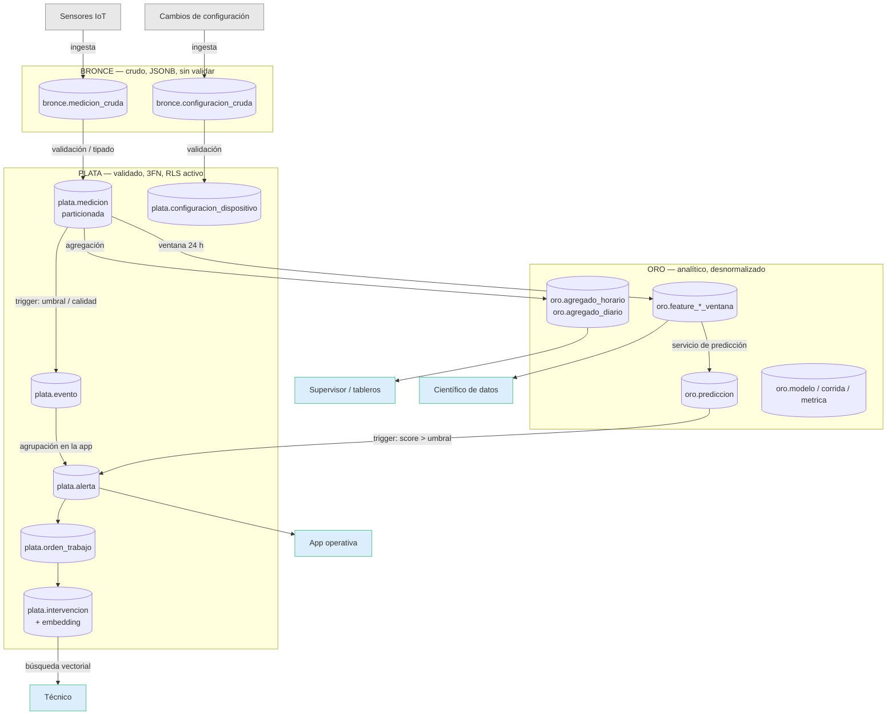

# 10. Arquitectura de datos

## 10.1 Descripción general

El sistema se organiza como un **lakehouse lógico dentro de un único PostgreSQL**: la arquitectura Medallion (bronce → plata → oro) implementada con *schemas*, no con sistemas separados. Cada capa representa un grado de madurez del dato, y entre capa y capa hay un proceso que transforma y valida. El dato entra crudo por bronce y va "subiendo" hasta quedar listo para el consumo analítico en oro.

## 10.2 Diagrama del flujo

El diagrama (fuente editable en `docs/arquitectura_datos.mmd`) muestra las tres capas, los procesos que llevan de una a otra y los consumidores finales:

## 10.3 Las capas y sus procesos

**Bronce — crudo.** Recibe el dato tal como llega de los sensores y de los cambios de configuración, en `JSONB`, sin claves foráneas ni validación. Su única función es no perder nada, aunque el dato venga incompleto o corrupto.

**Proceso de validación/tipado (bronce → plata).** Convierte el payload crudo en filas tipadas y validadas: descarta o marca lo que no cumple, y promueve el resto a plata. Es el punto donde el dato pasa a ser confiable.

**Plata — validado.** Capa normalizada (3FN) con integridad referencial y **RLS activo**. Acá vive la operación: mediciones, eventos, alertas, órdenes e intervenciones. Dos procesos internos corren por trigger: una medición fuera de umbral o de mala calidad genera un *evento*, y la agrupación de eventos en *alertas* la hace la aplicación.

**Proceso de agregación (plata → oro).** Calcula, con `INSERT ... SELECT`, los agregados horarios/diarios y las features por ventana. Es un dato derivado: si se pierde, se recalcula.

**Oro — analítico.** Capa desnormalizada, optimizada para lectura. Contiene los agregados, las features que consume el modelo, y el bloque de trazabilidad de la predicción (modelo, corrida, métrica, predicción).

**Escritura de vuelta.** El servicio de predicción lee las features de oro y escribe predicciones en oro; cuando una predicción supera el umbral, un trigger crea una alerta **de vuelta en plata**. Es la única dependencia que va de oro hacia plata.

## 10.4 Consumidores

- **App operativa** (operarios y técnicos): lee y escribe el estado operativo en plata, siempre bajo RLS.
- **Supervisor**: usa plata para el estado actual y oro para tendencias.
- **Científico de datos**: trabaja sobre oro, sin datos personales, con las features en formato ancho.
- **Técnico**: además consulta intervenciones pasadas por búsqueda vectorial sobre `intervencion`.

## 10.5 Límite base / aplicación

Criterio unificador de todo el diseño: **la base registra hechos; la aplicación gobierna procesos con estado**. La base deja constancia de que una alerta se abrió, una orden existe y una intervención se registró (por triggers o inserciones), pero no gestiona las transiciones: agrupar alertas de un mismo problema, asignar técnicos, escalar o cerrar son responsabilidad de la aplicación, fuera del alcance de este trabajo.
